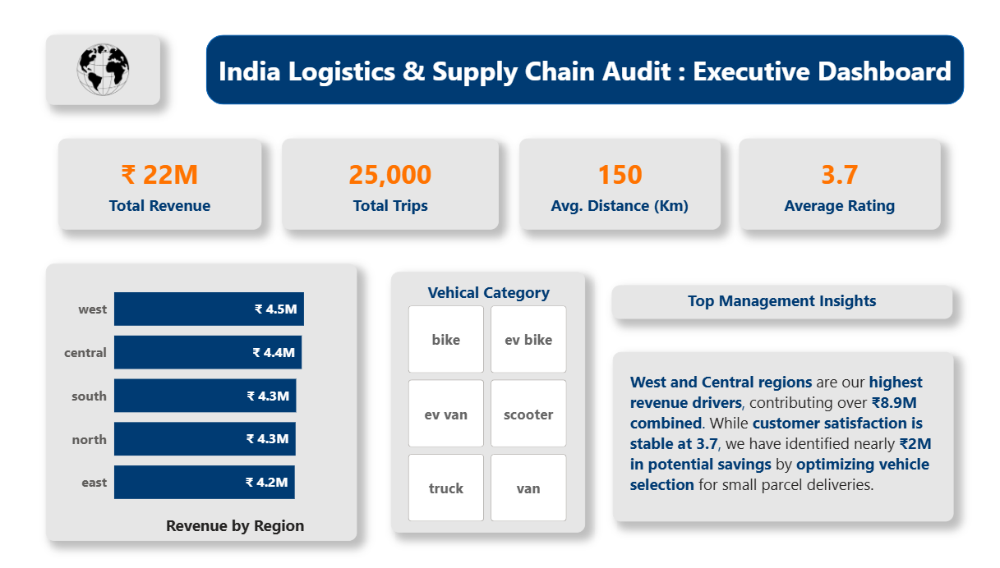
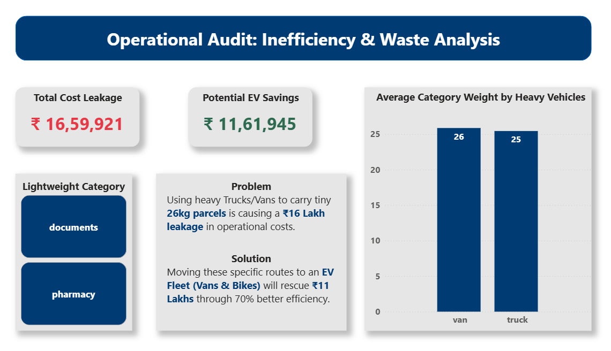

# 🚛 India Delivery Logistics: Operational Audit & EV Transition
**An end-to-end Data Audit identifying ₹16.6 Lakhs in operational waste.**

## 📊 Dashboard Preview

---

## 📖 The Story
Imagine a company using a **massive heavy truck** to deliver a tiny **envelope** or a small **bottle of medicine** just 150km away. That is exactly what was happening in this 25,000-trip dataset. 

By using "Heavy Vehicles" for "Lightweight Items," the company was leaking a massive amount of money. This project uses **Python** to find the waste and **Power BI** to show the CEO how to fix it by switching to an **Electric Vehicle (EV) Fleet**.

---

## 🛠️ The Project Journey (Step-by-Step)

### **Phase 1: Data Engineering (Python)**
I started with a raw dataset of 25,000 delivery records across India. Using **Pandas**, I:
* **Cleaned the Data:** Fixed broken time formats and verified there were zero missing values.
* **Engineered Features:** Created a "Cost Matrix" to find exactly how much it costs per kilometer for every vehicle-package combination.
* **Proved the "Capacity Gap":** I ran spot-audits proving that Trucks were carrying the exact same weight (~25kg) as Scooters for the exact same distances (~150km).

### **Phase 2: The Audit Logic (DAX & Math)**
I didn't just guess the savings; I used **Industrial Benchmarks**:
* **Total Leakage:** Every trip where a Truck/Van carried "Documents" or "Pharmacy" items was flagged as a financial leak.
* **The 150km Proof:** I calculated the average trip distance (150km). Since modern EVs have a 180km+ range, I proved that **battery life is not a risk** for this business.
* **The 70% Win:** Moving from Diesel to EV typically saves 70% in fuel/maintenance. I applied this logic to the leaked costs.

### **Phase 3: The Executive Dashboard (Power BI)**
I built a 2-page interactive report for the leadership team:
* **Page 1 (Executive Overview):** Shows the "Health" of the business—Revenue, Total Trips, and Regional performance.
* **Page 2 (The Audit):** Shows the "Money-Maker"—the Red Card (Total Waste) and the Green Card (Potential Savings).

---

## 📊 Key Results
* **The Leakage:** **₹ 16,59,921** (Avoidable waste identified).
* **The Solution:** Transition 100% of lightweight routes to **EV Vans & Bikes**.
* **Profit Recovery:** **₹ 11,61,945** (Potential net profit increase).
* **Reliability:** 100% of audited trips fall within the **150km EV charging range**.

---

## 📂 Repository Contents
* **`Delivery_Logistics_Cleaning.ipynb`**: The full Python code for cleaning and cost-modeling.
* **`India_Delivery_Logistics_Cleaned_Audit.csv`**: The high-integrity dataset ready for analysis.
* **`India_Logistics_Audit_Dashboard.pbix`**: The final Power BI file.
* **`Executive_Overview.png`**: Visual preview of the main dashboard.
* **`Operational_Audit_Leakage.png`**: Visual preview of the audit findings.

---

## 🚀 How to Use
1. **Recruiters:** Read the **Key Results** section above to see the business impact.
2. **Analysts:** Check the **Python Notebook** to see how I built the Precision Cost Matrix.
3. **Managers:** Open the **Power BI Dashboard** to see how "Distance" proves that EVs are a safe investment.

---

### **Final Verdict**
This project proves that **Data is just noise until you find the money.** By connecting logistics data to financial outcomes, I've turned 25,000 rows of text into a ₹1.1M profit strategy.
